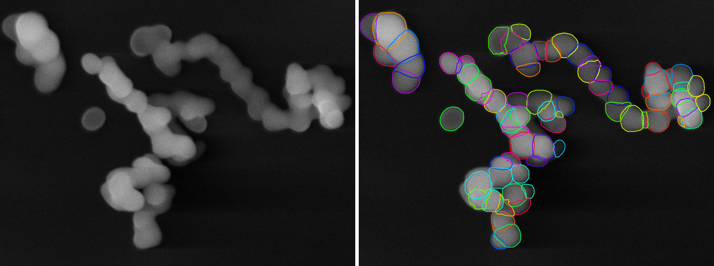
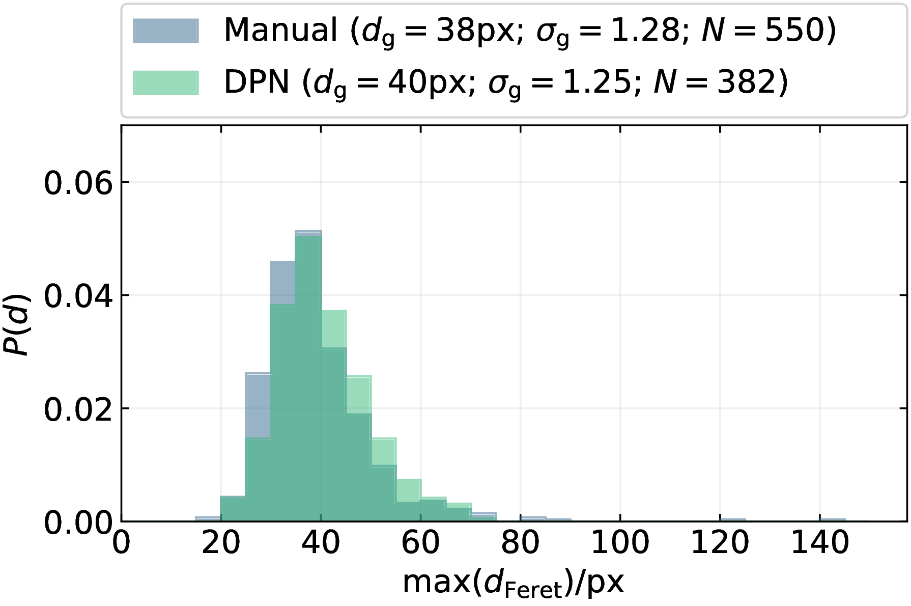

:toc:
= paddle (PArticle Detection via Deep LEarning)

image:https://img.shields.io/badge/DOI-10.1016/j.powtec.2019.10.020-blue.svg[link="https://doi.org/10.1016/j.powtec.2019.10.020"]
image:https://img.shields.io/badge/arXiv-1907.05112-b31b1b.svg[link="https://arxiv.org/abs/1907.05112"]
image:https://img.shields.io/github/license/maxfrei750/paddle.svg[link="https://github.com/maxfrei750/paddle/blob/master/LICENSE"]
image:https://img.shields.io/badge/code%20style-black-000000.svg[link="https://github.com/psf/black"]
image:https://img.shields.io/lgtm/alerts/g/maxfrei750/paddle.svg?logo=lgtm&logoWidth=18[link="https://lgtm.com/projects/g/maxfrei750/paddle/alerts/"]
image:https://img.shields.io/lgtm/grade/python/g/facebookresearch/hydra.svg?logo=lgtm&logoWidth=18[link="https://lgtm.com/projects/g/maxfrei750/paddle/context:python"]

'''
[discrete]
== 🚧 UNDER DEVELOPMENT 🚧

Everything in this repository (except https://github.com/maxfrei750/paddle/releases[releases]) may change at any given point in time.

'''

This repository is a toolbox for the easy, deep learning-based primary particle size analysis of agglomerated, aggregated, partially sintered or simply occluded particles. It is the successor of the https://github.com/maxfrei750/DeepParticleNet[DeepParticleNet] toolbox, which accompanies the following publication:

https://doi.org/10.1016/j.powtec.2019.10.020[Image-Based Size Determination of Agglomerated
and Partially Sintered Particles via Convolutional Neural Networks]

The utilized convolutional neural network is based on the Mask R-CNN architecture, developed by https://arxiv.org/abs/1703.06870[He et al.]. It was implemented using https://pytorch.org/[PyTorch], https://github.com/pytorch/vision[torchvision] and https://github.com/PyTorchLightning/pytorch-lightning[PyTorchLightning].

== Installation
. Install https://conda.io/en/latest/miniconda.html[conda] for your operating system.
. Open a command line.
. Clone this repository: `git clone https://github.com/maxfrei750/paddle.git`
. Change into the folder of the repository: `cd paddle`
. Create a new conda environment: `conda env create --file environment.yaml`

== Getting started
. Open a command line.
. Activate the conda environment: `activate paddle`
. Start JupyterLab: `jupyter lab` and click one of the links to access the JupyterLab server.
. In JupyterLab, navigate to the `paddle/demos` folder and choose a demo of your liking.

== Citation
If you use this repository for a publication, then please cite it using the following bibtex-entry:

[source,bibtex]
----
@article{Frei.2019,
    author = {Frei, Max and Kruis, Frank Einar},
    year = {2019},
    title = {Image-Based Size Analysis of Agglomerated and Partially Sintered Particles via Convolutional Neural Networks},
    url = {https://doi.org/10.1016/j.powtec.2019.10.020}
}
----

